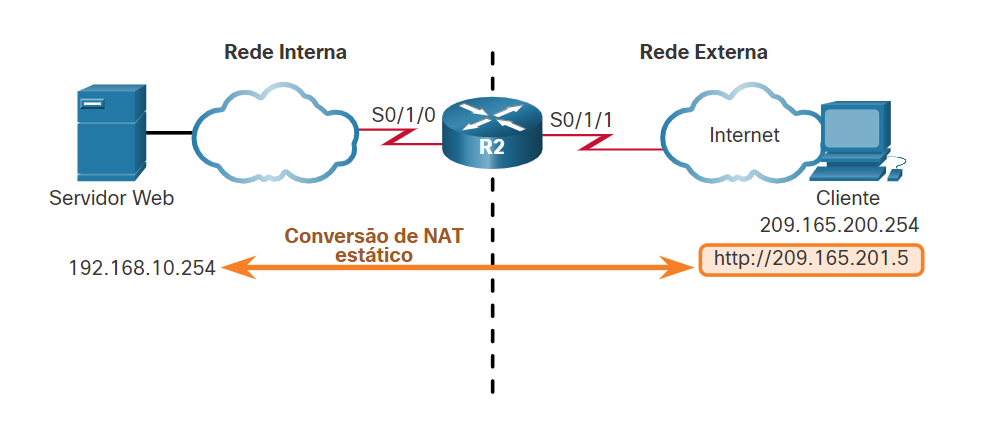
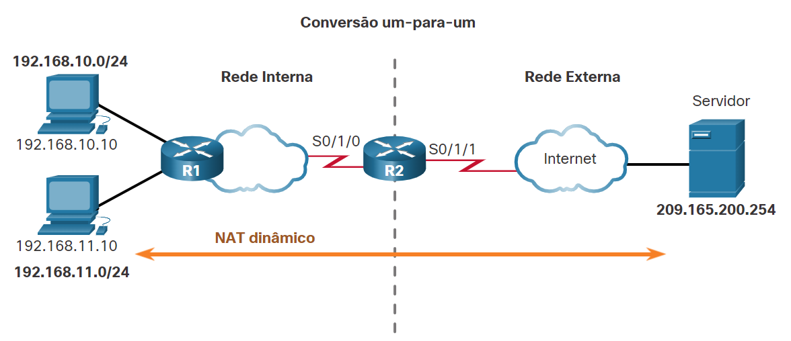
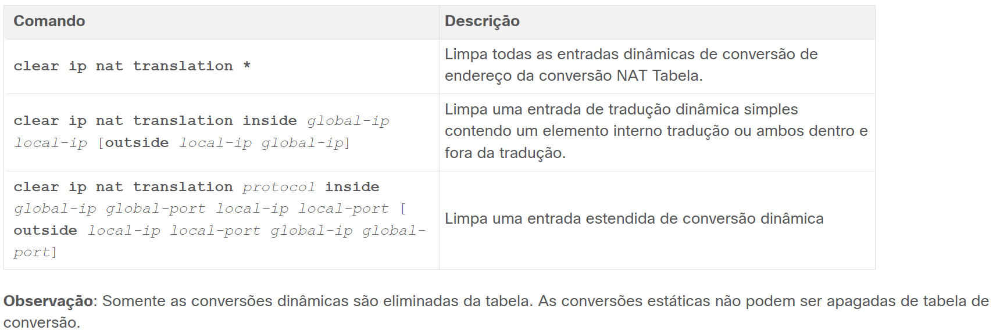
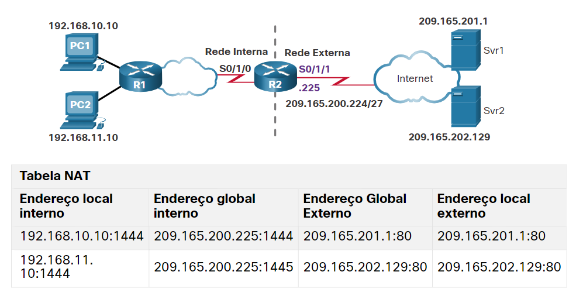
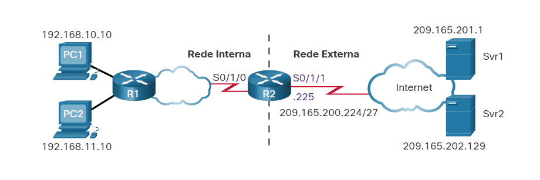

# NAT - Network Address Translation

    # Tipos de NAT

        - NAT estático
            O NAT estático usa um mapeamento de um para um de endereços locais e globais. Esses mapeamentos são configurados pelo administrador da rede e permanecem constantes.
            O NAT estático é particularmente útil para servidores web ou dispositivos que precisam ter um endereço consistente acessíveis da Internet, como um Servidor web de uma empresa. Ele é útil também para os dispositivos que devem ser acessíveis por pessoal autorizado remoto, mas não pelo público geral da Internet.

        - NAT dinâmico
            O NAT dinâmico usa um pool de endereços públicos e os atribui por ordem de chegada. Quando as solicitações internas de um dispositivo acessam uma rede externa, o NAT dinâmico designa um endereço IPv4 público disponível do pool.

        - PAT Port Address Translation
            A conversão do PAT, também conhecida como sobrecarga de NAT, mapeia os endereços IPv4 privados para um único endereço IPv4 público ou para alguns endereços.
            O PAT tenta preservar a porta origem. No entanto, se a porta origem estiver sendo usada atualmente, o PAT atribui o primeiro número de porta disponível a partir do início do grupo de portas apropriado 0–511, 512–1.023 ou 1.024–65.535. Quando não houver mais portas disponíveis e houver mais de um endereço externo no pool de endereços, o PAT passa para o próximo endereço para tentar alocar a porta origem. Esse processo continua, até que não haja mais portas ou endereços IPv4 externos disponíveis.
        

    # Cenário NAT estático

        

    # Configurar o NAT estático

        Há duas tarefas básicas na configuração de conversões estáticas de NAT.

        Etapa 1. A primeira tarefa é criar um mapeamento entre o endereço local interno e endereços globais de entrada. Por exemplo, o endereço local interno 192.168.10.254 e o endereço global interno 209.165.201.5 da Figura são configurados como uma conversão de NAT estático.

        R2(config)# ip nat inside source static 192.168.10.254 209.165.201.5

        Etapa 2. Depois que o mapeamento é configurado, as interfaces que participam da conversão são configuradas como internas ou externas com relação ao NAT. No exemplo, a interface serial 0/1/0 do R2 é uma interface interna e a serial 0/1/1 é uma interface externa.

        R2(config)# interface serial 0/1/0
        R2(config-if)# ip address 192.168.1.2 255.255.255.252
        R2(config-if)# ip nat inside
        R2(config-if)# exit
        R2(config)# interface serial 0/1/1
        R2(config-if)# ip address 209.165.200.1 255.255.255.252
        R2(config-if)# ip nat outside

    # Verificar NAT estático

        show ip nat translations

        show ip nat statistics
            Exibe informações sobre o número total de traduções ativas, os parâmetros de configuração do NAT, o número de endereços no pool e o número de endereços que foram alocados.

    # Limpar as estatísticas NAT
        clear ip nat statistics

    # 
        show running-config
        show ip nat translations
        show ip nat statistics    

    # NAT dinâmico

        
    

    # Configuração de NATs dinâmicos

        Etapa 1
            Defina o pool de endereços que serão usados para conversão usando o comando ip nat pool.
            Os endereços são definidos pela indicação do endereço IPv4 inicial e endereço IPv4 final do pool. A palavra-chave netmask ou prefix-length indica que bits do endereço pertencem à rede e que os bits pertencem ao host para o intervalo de endereços.

                R2(config)# ip nat pool NAT-POOL1 209.165.200.226 209.165.200.240 netmask 255.255.255.224

            Etapa 2
                Configure uma ACL padrão para identificar (permitir) somente os endereços a serem convertidos. Uma ACL que seja muito permissiva pode causar resultados imprevisíveis. Lembre-se de que existe uma instrução deny all implícita no final de cada ACL.
                
                R2(config)# access-list 1 permit 192.168.0.0 0.0.255.255

            Etapa 3
                Vincule a ACL ao pool, usando a seguinte sintaxe de comando:
                Router(config)# ip nat inside source list { access-list-number | access-list-name} pool pool-name
                Essa configuração é usada pelo roteador para identificar quais dispositivos (list) receberão o endereçamento (pool). No cenário, vincular NAT-POOL1 com ACL 1.

                R2(config-if)# ip nat inside source list 1 pool NAT-POOL1

            Etapa 4
                Identifique quais interfaces são internas em relação ao NAT, ou seja, uma interface que se conecta à rede interna.
                Identifica a interface serial 0/1/0 como uma interface interna de NAT.

                R2(config)# interface serial 0/1/0
                R2(config-if)# ip nat inside

            Etapa 5
                Identifique quais interfaces estão externas, em relação ao NAT; essa será qualquer interface que se conecte à rede externa.
                No cenário, identifique a interface serial 0/1/1 como a interface NAT externa.

                R2(config)# interface serial 0/1/1
                R2(config-if)# ip nat outside

            # Verificar NAT dinâmico
                R2# show ip nat translations 

                R2# show ip nat translation verbose

               

                Outro comando útil,show ip nat statistics, exibe informações sobre o número total de traduções ativas, parâmetros de configuração NAT, o número de endereços no pool e quantos endereços foram alocados.

                R2# show ip nat statistics 

            
            Como alternativa, você pode usar o comando show running-config e procurar comandos NAT, ACL, interface ou pool com os valores necessários. Examine-os cuidadosamente e corrija quaisquer erros descobertos. O exemplo mostra a configuração do pool NAT.

                R2# show running-config | include NAT
                ip nat pool NAT-POOL1 209.165.200.226 209.165.200.240 netmask 255.255.255.224
                ip nat inside source list 1 pool NAT-POOL1

    # PAT Port Address Translation 

            Cenário
                  

            
            # Configurar PAT para usar um único endereço IPv4
                Para configurar o PAT para usar um único endereço IPv4, basta adicionar a palavra-chave overload ao ip nat inside source comando. O restante da configuração é semelhante à configuração NAT estática e dinâmica, exceto que com PAT, vários hosts podem usar o mesmo endereço IPv4 público para acessar a internet.
                No exemplo, todos os hosts da rede 192.168.0.0/16 (que correspondem à ACL1) que enviam tráfego pelo roteador R2 para a Internet serão convertidos ao endereço IPv4 209.165.200.225 (endereço IPv4 da interface serial S0/1/1). Os fluxos de tráfego serão identificados por números de porta na tabela NAT, pois a palavra-chave overload foi usada.

                    R2(config)# ip nat inside source list 1 interface serial 0/1/1 overload
                    R2(config)# access-list 1 permit 192.168.0.0 0.0.255.255
                    R2(config)# interface serial0/1/0
                    R2(config-if)# ip nat inside
                    R2(config-if)# exit
                    R2(config)# interface Serial0/1/1
                    R2(config-if)# ip nat outside

            
            # Configurar o PAT para usar um pool de endereços
                Um ISP pode alocar mais de um endereço IPv4 público para uma organização. Nesse cenário, a organização pode configurar o PAT para usar um pool de endereços públicos IPv4 para tradução.
                Se um site tiver emitido mais de um IPv4 público, esses endereços podem ser parte de um pool usado pelo PAT. O pequeno pool de endereços é compartilhado entre um número maior de dispositivos, com vários hosts usando o mesmo endereço IPv4 público para acessar a internet. Para configurar o PAT para um pool de endereços NAT dinâmico, basta adicionar a palavra-chave overload ao ip nat inside source comando.
                A topologia desse cenário é repetida na figura para sua conveniência.

                

                No exemplo, o NAT-POOL2 está vinculado a uma ACL para permitir que 192.168.0.0/16 seja traduzido. Esses hosts podem compartilhar um endereço IPv4 do pool porque PAT está habilitado com a palavra-chave overload.

                    R2(config)# ip nat pool NAT-POOL2 209.165.200.226 209.165.200.240 netmask 255.255.255.224
                    R2(config)# access-list 1 permit 192.168.0.0 0.0.255.255
                    R2(config)# ip nat inside source list 1 pool NAT-POOL2 overload
                    R2(config)# 
                    R2(config)# interface serial0/1/0
                    R2(config-if)# ip nat inside
                    R2(config-if)# exit
                    R2(config)# interface serial0/1/1
                    R2(config-if)# ip nat outside
                    R2(config-if)# end
                    R2#